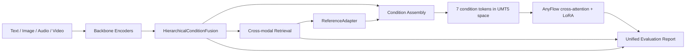

# MUGen-VR

**Unified Multimodal Representation + Retrieve-then-Generate + Robust Condition Fusion**

MUGen-VR is a multimodal video system for understanding, retrieval, and controllable generation. Foundation models are used as frozen backbones; the project-owned contribution is the trainable condition layer that fuses multimodal inputs, retrieves reference videos, injects reference features into generation, and reports what worked or failed.

## Architecture



## Highlights

- `HierarchicalConditionFusion`: projects text, image, and audio conditions into a shared space and exposes modality weights.
- `Real multimodal features`: ImageBind text/image/audio features and InternVideo2 video/reference features are stored in versioned `safetensors + JSONL` shards.
- `Reference-guided Retrieve-then-Generate`: self-excluding top-k retrieval is aggregated into four score-aware reference tokens.
- `Direct AnyFlow injection`: three fusion tokens and four reference tokens are projected into the 4096-dimensional UMT5 space and appended to `prompt_embeds`.
- `Practical evaluation`: release evaluation decodes real MP4 files and compares four job-relevant ablations on held-out VBench, retrieval, audio-flow, latency, and VRAM metrics.

## Quick Start

```bash
pip install -e .
python -c "import mugen; print('ok')"
python -m pytest -q
python scripts/prepare_data/build_msrvtt_manifest.py --help
python scripts/extract_features/extract_real_features.py --help
```

The CPU smoke test does not download model weights or generate fake release metrics.
Real training requires locally installed third-party repositories, their upstream
checkpoints, and an MSR-VTT media manifest with decodable audio.

Train the project-owned fusion and reference modules from real cached features:

```bash
python scripts/train/train_fusion.py \
  --config configs/training/fusion.yaml \
  --feature-store cache/features/msrvtt-real-v1
```

Train AnyFlow cross-attention LoRA plus the condition projector (one process per GPU):

```bash
accelerate launch --num_processes 4 scripts/train/train_lora.py \
  --config configs/training/lora_project.yaml \
  --feature-store cache/features/msrvtt-real-v1 \
  --fusion-checkpoint outputs/fusion-real-v1/best-seed-42.pt \
  --output-dir outputs/lora-project-v1-train-only
```

## Fixed B0-B3 Evaluation

Build the local 40-sample held-out manifest and eight-case showcase from the exact
feature-extraction subset. Generated manifests remain local because they contain media paths.

```bash
python scripts/eval/build_project_eval_manifest.py \
  --media-manifest data/msrvtt/media_manifest_v1_6000.jsonl \
  --output data/msrvtt/project_eval_40.jsonl \
  --case-output data/msrvtt/project_cases_8.jsonl
```

Evaluate retrieval, then generate one deterministic partition per GPU:

```bash
python scripts/eval/evaluate_project_retrieval.py \
  --eval-manifest data/msrvtt/project_eval_40.jsonl \
  --feature-store cache/features/msrvtt-real-v1 \
  --conditioner-checkpoint outputs/lora-project-v1-train-only/checkpoint-300/conditioner.pt \
  --output reports/project/retrieval.json

for partition in 0 1 2 3; do
  CUDA_VISIBLE_DEVICES=$partition python scripts/eval/generate_project_ablation.py \
    --eval-manifest data/msrvtt/project_eval_40.jsonl \
    --feature-store cache/features/msrvtt-real-v1 \
    --lora-checkpoint outputs/lora-project-v1-train-only/checkpoint-300 \
    --output-dir outputs/project-ablation-final \
    --condition-scale 0.1 \
    --num-partitions 4 --partition-index $partition \
    > data/msrvtt/generation-part-$partition.log 2>&1 &
done
wait
```

Run the real-video metrics and strict completion report. VBench is imported from the pinned
source checkout in `third_party/VBench`; its pinned Transformers dependency is not installed
over the AnyFlow environment.

```bash
python scripts/eval/evaluate_audio_control.py \
  --manifest outputs/project-ablation-final/results-part-*.jsonl \
  --output reports/project-final/audio-control.json

for variant in B0 B1 B2 B3; do
  python scripts/eval/run_evaluation.py \
    --generated_dir outputs/project-ablation-final/$variant \
    --output reports/project-final/vbench/$variant
done

python scripts/eval/merge_project_metrics.py \
  --generation-dir outputs/project-ablation-final \
  --retrieval reports/project/retrieval.json \
  --audio reports/project-final/audio-control.json \
  --vbench-root reports/project-final/vbench \
  --output reports/project-final/ablation-input.jsonl

python scripts/eval/ablation_study.py \
  --input reports/project-final/ablation-input.jsonl \
  --case-manifest data/msrvtt/project_cases_8.jsonl \
  --output reports/project-final/final-report.json
```

Stage the Hugging Face Model upload from an explicit whitelist:

```bash
python scripts/release/package_hf_model.py \
  --checkpoint outputs/lora-project-v1-train-only/checkpoint-300 \
  --evaluation reports/project-final/final-report.json \
  --output release/hf_model \
  --condition-scale 0.1
```

This copies only MUGen-owned conditioner/LoRA weights, sanitized configuration,
evaluation, checksums, and the Model Card. It excludes optimizer state, upstream
weights, media, and cached features.


## Showcase: Multimodal Condition Path

The public demo is a video-first showcase. The report is included for explainability, but the primary artifact is the generated MP4:

```bash
python scripts/showcase/run_multimodal_showcase.py \
  --mode report \
  --prompt "a dog running on grass with cinematic motion" \
  --image third_party/ImageBind/.assets/dog_image.jpg \
  --output_dir outputs/showcase/multimodal_report_only
```

This produces:

- `result.mp4` when `--mode generate` is used and a GPU is available.
- `report.md` / `report.json` for the explainable condition trace.
- `gating_weights.json` and `retrieval_results.json` for the multimodal condition summary.

For a report-only dry run:

```bash
python scripts/showcase/run_multimodal_showcase.py \
  --mode report \
  --prompt "a dog running on grass with upbeat rhythmic background music" \
  --image third_party/ImageBind/.assets/dog_image.jpg
```

The showcase script is retained as a historical prototype and must not be used for
release claims. The release path is `real media -> feature store -> fusion/reference
training -> condition tokens -> AnyFlow prompt_embeds -> real MP4 -> strict evaluation`.

## Backbones

- InternVideo for video understanding and retrieval features.
- ImageBind for multimodal embedding prototypes.
- AnyFlow-FAR / Diffusers for video generation.
- VBench for optional video generation evaluation.

Backbones are not vendored as trained weights. Their licenses and model cards should be checked before redistribution.

## Project Layout

```text
src/mugen/        # project-owned package
scripts/          # training, inference, and evaluation entrypoints
configs/          # data, training, inference, and evaluation configs
docs/             # architecture, method, experiments, third-party commits
tests/            # smoke and unit tests
reports/          # generated reports, not model outputs
```

## Verified Status

- ImageBind real text/image encoding: verified at `(1, 1024)` with unit-norm output.
- InternVideo2 real video encoding: verified at `(1, 768)` with unit-norm output.
- Formal real-feature training: 2,000 Fusion steps and 300 four-GPU AnyFlow LoRA steps with train-only references.
- Fixed 40-sample, seed-42 evaluation and eight side-by-side cases: completion check passed.
- Validation-selected condition scale `0.1` reduced B3 VBench degradation from `0.7260` to `0.7570`; B0 remained best at `0.7600`, while B2 reached `0.7596`.
- Final B2/B3 retrieval MRR: `1.0000` / `0.9813`; final B3 audio-flow correlation: `0.0046`. These results do not support a quality-improvement claim.
- Four-step latency: B0 `4.42 s`, B3 `4.31 s`; peak VRAM `15.61 GiB` on one RTX 3090.

UMT5, VAE, and the base AnyFlow transformer remain frozen. Trainable parameters are
MUGen Fusion, Reference Adapter, the 4096-dimensional condition projector, and LoRA
weights restricted to AnyFlow cross-attention `q/k/v/out` projections.

## License

MIT for project-owned code. Third-party backbones keep their original licenses.
