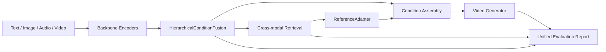

# MUGen-VR

**Unified Multimodal Representation + Retrieve-then-Generate + Robust Condition Fusion**

MUGen-VR is a multimodal video system for understanding, retrieval, and controllable generation. Foundation models are used as frozen backbones; the project-owned contribution is the trainable condition layer that fuses multimodal inputs, retrieves reference videos, injects reference features into generation, and reports what worked or failed.

## Architecture



## Highlights

- `HierarchicalConditionFusion`: projects text, image, and audio conditions into a shared space and exposes modality weights.
- `Audio-aware prompt planning`: parses music, rhythm, mood, and sound cues from the prompt or audio file and turns them into generation guidance.
- `Reference-guided Retrieve-then-Generate`: retrieves similar videos and uses the references to rewrite the generation prompt.
- `Unified evaluation report`: records retrieval, fusion, and generation metadata with explicit skipped metrics when backbones are unavailable.

## Quick Start

```bash
pip install -e .
python -c import mugen; print('ok')
python scripts/showcase/run_multimodal_showcase.py --mode generate --output_dir outputs/showcase/demo \
  --prompt "a dog running on grass with upbeat rhythmic background music" \
  --image third_party/ImageBind/.assets/dog_image.jpg
python scripts/train/train_fusion.py --config configs/training/fusion.yaml --max_steps 100
python scripts/eval/run_evaluation.py --generated_dir outputs --output reports/demo_report
```

GPU AnyFlow smoke test, after the model cache is complete:

```bash
CUDA_VISIBLE_DEVICES=1 python scripts/infer/generation_demo.py \
  --generator anyflow \
  --image third_party/ImageBind/.assets/dog_image.jpg \
  --prompt a dog running on grass \
  --num_frames 25 \
  --output outputs/anyflow_smoke.mp4
```


## Showcase: Multimodal Condition Path

The public demo is a video-first showcase. The report is included for explainability, but the primary artifact is the generated MP4:

```bash
python scripts/showcase/run_multimodal_showcase.py \
  --mode report \
  --prompt "a dog running on grass with cinematic motion" \
  --image third_party/ImageBind/.assets/dog_image.jpg \
  --output_dir outputs/showcase/multimodal_report_only
```

This produces:

- `result.mp4` when `--mode generate` is used and a GPU is available.
- `report.md` / `report.json` for the explainable condition trace.
- `gating_weights.json` and `retrieval_results.json` for the multimodal condition summary.

For a report-only dry run:

```bash
python scripts/showcase/run_multimodal_showcase.py \
  --mode report \
  --prompt "a dog running on grass with upbeat rhythmic background music" \
  --image third_party/ImageBind/.assets/dog_image.jpg
```

Current boundary: AnyFlow consumes prompt + image/video conditioning. Audio affects the MUGen fusion weights, retrieval query, and prompt planning; it is not yet injected directly into AnyFlow latent states.

## Backbones

- InternVideo for video understanding and retrieval features.
- ImageBind for multimodal embedding prototypes.
- AnyFlow-FAR / Diffusers for video generation.
- VBench for optional video generation evaluation.

Backbones are not vendored as trained weights. Their licenses and model cards should be checked before redistribution.

## Project Layout

```text
src/mugen/        # project-owned package
scripts/          # training, inference, and evaluation entrypoints
configs/          # data, training, inference, and evaluation configs
docs/             # architecture, method, experiments, third-party commits
tests/            # smoke and unit tests
reports/          # generated reports, not model outputs
```

## Current Training Policy

We train small MUGen-owned modules first: fusion, reference adapter, and optional reranker. Foundation backbones stay frozen. AnyFlow LoRA is optional second-stage work after the core pipeline is stable.

## License

MIT for project-owned code. Third-party backbones keep their original licenses.
