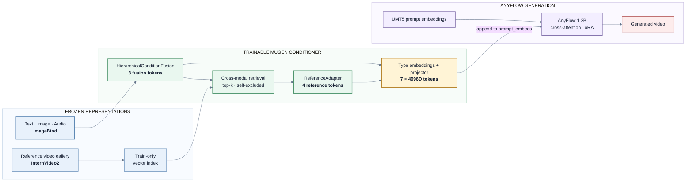

# MUGen-VR

Multimodal condition-token injection and retrieval-augmented video generation on AnyFlow.

[Hugging Face Model](https://huggingface.co/TomLjm/MUGen-VR-AnyFlow-Conditioner) | [Evaluation Space](https://huggingface.co/spaces/TomLjm/MUGen-VR-Evaluation)

MUGen-VR combines ImageBind text, image, and audio features with InternVideo2 video
features. A trainable conditioner produces three fusion tokens and four retrieved-reference
tokens, projects them into the UMT5 embedding space, and appends them directly to AnyFlow
`prompt_embeds`. AnyFlow is adapted through cross-attention LoRA while its text encoder,
VAE, and base transformer remain frozen.

## Architecture



Core components:

- `HierarchicalConditionFusion` maps text, image, and audio features to three condition tokens.
- `ReferenceAdapter` aggregates top-k retrieved videos into four score-aware tokens.
- `MultimodalConditioner` adds modality/type embeddings and projects all seven tokens to 4096 dimensions.
- `ConditionBundle` carries normalized prompt, image, audio, reference, mask, and trace metadata.
- `AnyFlowVideoGenerator` consumes the bundle through direct `prompt_embeds` injection.

## Results

Evaluation uses 40 fixed held-out MSR-VTT clips, generation seed 42, and a condition
scale selected on eight validation clips. Metrics are computed from decoded MP4 files.

| Variant | Definition | VBench | Retrieval MRR | Audio-flow | Latency |
|---|---|---:|---:|---:|---:|
| B0 | AnyFlow image + original prompt | 0.7600 | n/a | 0.0179 | 4.42 s |
| B1 | Prompt rewrite prototype | 0.7511 | n/a | 0.0363 | 4.26 s |
| B2 | Fusion tokens without audio/reference | 0.7596 | 1.0000 | -0.0012 | 4.28 s |
| B3 | Full fusion + audio + reference | 0.7570 | 0.9813 | 0.0046 | 4.31 s |

B2 preserves baseline VBench within `0.0004`. The current B3 checkpoint does not improve
aggregate generation quality, retrieval, or audio control, so no improvement claim is made.
Peak inference memory is `15.61 GiB` on one RTX 3090.

See [docs/experiments.md](docs/experiments.md) for the evaluation protocol and commands.

## Installation

```bash
conda create -n mugen python=3.10 -y
conda activate mugen
pip install -e .
python -m pytest -q
```

The CPU test suite does not download model weights. Full training and generation require
local copies of the upstream repositories and checkpoints listed in
[`third_party/manifest.yaml`](third_party/manifest.yaml).

## Data And Features

MUGen-VR does not distribute MSR-VTT media or cached third-party features. Build a local
manifest, then extract versioned `safetensors + JSONL` feature shards:

```bash
python scripts/prepare_data/build_msrvtt_manifest.py --help
python scripts/extract_features/extract_real_features.py \
  --manifest data/msrvtt/media_manifest.jsonl \
  --output cache/features/msrvtt-real-v1 \
  --resume
```

Splits are isolated by `video_id`. Reference retrieval excludes the query video and
near-duplicate media hashes.

## Training

Train the fusion and reference modules:

```bash
python scripts/train/train_fusion.py \
  --config configs/training/fusion.yaml \
  --feature-store cache/features/msrvtt-real-v1
```

Train the condition projector and AnyFlow cross-attention LoRA:

```bash
accelerate launch --num_processes 4 scripts/train/train_lora.py \
  --config configs/training/lora_project.yaml \
  --feature-store cache/features/msrvtt-real-v1 \
  --fusion-checkpoint outputs/fusion-real-v1/best-seed-42.pt \
  --output-dir outputs/lora-project-v1-train-only
```

The final run used 2,000 fusion steps and 300 four-GPU LoRA steps with a train-only
reference gallery. Checkpoints include optimizer state, RNG state, feature versions,
and configuration for deterministic resume.

## Demo

The local demo runs B0 and B3 side by side and displays retrieved references, gating
weights, and latency:

```bash
python scripts/demo/gradio_app.py --help
```

The hosted Space is a static evaluation viewer and does not run persistent GPU inference.

## Repository Layout

```text
src/mugen/       project-owned Python package
scripts/         data, training, inference, evaluation, and release entrypoints
configs/         reproducible experiment configuration
tests/           unit, integration, and resume tests
hf_space/        static B0/B3 evaluation viewer
```

## Limitations

- Audio control is indirect through condition tokens and does not synthesize a soundtrack.
- Retrieval depends on a separately licensed local reference gallery.
- The released checkpoint does not outperform the B0 baseline on aggregate VBench.
- Reproduction requires upstream models that are not redistributed by this repository.

## License

Project-owned code is released under MIT. AnyFlow and ImageBind retain non-commercial
upstream restrictions. See [THIRD_PARTY_NOTICES.md](THIRD_PARTY_NOTICES.md) before using
the model or generated assets.
