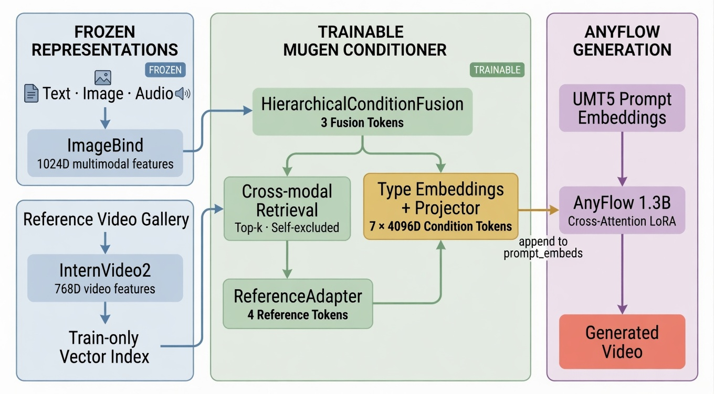

# MUGen-VR

基于 AnyFlow 的多模态条件 Token 注入与检索增强视频生成。

[English](README.md)

[Hugging Face 模型](https://huggingface.co/TomLjm/MUGen-VR-AnyFlow-Conditioner) | [评测 Space](https://huggingface.co/spaces/TomLjm/MUGen-VR-Evaluation)

MUGen-VR 融合 ImageBind 的文本、图像和音频特征，以及 InternVideo2 的视频特征。可训练的条件模块生成三个融合 Token、四个检索参考 Token 和八个时序音频 Token，将它们投影到 UMT5 embedding 空间后，直接追加到 AnyFlow 的 `prompt_embeds`。AnyFlow 主干保持冻结。

## 架构

<p align="center">
  <a href="docs/assets/mugen-vr-architecture.jpeg">
    
  </a>
</p>

核心组件：

- `HierarchicalConditionFusion`：将文本、图像和音频特征映射为三个条件 Token。
- `ReferenceAdapter`：将 top-k 检索视频聚合为四个带分数感知的参考 Token。
- `MultimodalConditioner`：加入模态/类型 embedding，并将全部 15 个 Token 投影到 4096 维。
- `ConditionBundle`：承载规范化 prompt、图像、音频、参考视频、模态 mask 和追踪元数据。
- `AnyFlowVideoGenerator`：通过直接注入 `prompt_embeds` 消费条件 bundle。

## 重点一致性结果

评测使用 40 个固定的 MSR-VTT held-out 视频片段，生成 seed 为 42，条件 scale 在独立验证集上选择。所有指标均基于解码后的 MP4 文件，并使用官方 VBench 维度评测器计算。

| 指标 | 冻结 AnyFlow | MUGen-VR | 变化 |
|---|---:|---:|---:|
| Subject consistency | 0.88328 | **0.88596** | **+0.00268** |
| Motion smoothness | 0.98201 | **0.98248** | **+0.00046** |
| Temporal flickering | 0.96963 | **0.96978** | **+0.00014** |

条件路径使 subject consistency 误差相对冻结主干降低 `2.29%`，同时提升了两个报告中的时序一致性维度。默认推理路径只增加项目自有的条件模块，并保持 AnyFlow 冻结。在单张 RTX 3090 上，峰值推理显存为 `15.61 GiB`。

评测协议和命令见 [docs/experiments.md](docs/experiments.md)。

## 安装

```bash
conda create -n mugen python=3.10 -y
conda activate mugen
pip install -e .
python -m pytest -q
```

CPU 测试不会下载模型权重。完整训练和生成需要本地准备上游仓库及 checkpoint，具体列表见 [`third_party/manifest.yaml`](third_party/manifest.yaml)。

## 数据与特征

MUGen-VR 不分发 MSR-VTT 原始媒体或第三方缓存特征。请先构建本地 manifest，再提取带版本信息的 `safetensors + JSONL` 特征 shard：

```bash
python scripts/prepare_data/build_msrvtt_manifest.py --help
python scripts/extract_features/extract_real_features.py \
  --manifest data/msrvtt/media_manifest.jsonl \
  --output cache/features/msrvtt-real-v1 \
  --resume
```

数据划分按 `video_id` 隔离。参考视频检索会排除查询视频本身及媒体哈希近重复样本。

## 训练

训练融合模块和参考适配器：

```bash
python scripts/train/train_fusion.py \
  --config configs/training/fusion.yaml \
  --feature-store cache/features/msrvtt-real-v1
```

训练条件投影器（入口也支持可选的 cross-attention LoRA）：

```bash
accelerate launch --num_processes 4 scripts/train/train_lora.py \
  --config configs/training/lora_project.yaml \
  --feature-store cache/features/msrvtt-real-v1 \
  --fusion-checkpoint outputs/fusion-real-v1/best-seed-42.pt \
  --output-dir outputs/mugen-conditioner
```

checkpoint 包含优化器状态、随机数状态、特征版本和配置，可用于确定性断点续训。发布的推理配置只加载项目自有的条件模块权重，并保持 AnyFlow 冻结。

## Demo

本地 Demo 并排运行 B0 和 B3，并展示检索参考、gating 权重和延迟：

```bash
python scripts/demo/gradio_app.py --help
```

在线 Space 是静态评测展示页，不运行持续 GPU 推理。

## 仓库结构

```text
src/mugen/       项目自有 Python 包
scripts/         数据、训练、推理、评测和发布入口
configs/         可复现实验配置
tests/           单元、集成和断点续训测试
hf_space/        静态 B0/B3 评测展示页
```

## 使用范围

- 音频条件用于控制视频 Token，不会合成输出音轨。
- 检索使用单独授权的本地参考库。
- 复现需要上游模型，这些模型不由本仓库重新分发。

## 许可证

项目自有代码采用 MIT 许可证。AnyFlow 和 ImageBind 仍受上游非商业使用限制约束。使用模型或生成资产前，请阅读 [THIRD_PARTY_NOTICES.md](THIRD_PARTY_NOTICES.md)。
